# 📚 SISTEM PENERIMAAN PESERTA DIDIK BARU (PPDB) ONLINE

<div align="center">


</div>

## 📋 Deskripsi
Sistem PPDB Online adalah aplikasi berbasis web yang dibuat untuk mempermudah proses penerimaan peserta didik baru. Sistem ini menyediakan platform yang efisien untuk mengelola pendaftaran, verifikasi dokumen, dan proses seleksi siswa baru.

### ⭐ Keunggulan Sistem
- Interface yang modern dan responsif
- Manajemen data yang tersentralisasi
- Proses verifikasi yang transparan
- Dashboard admin yang informatif
- Tracking status pendaftaran real-time

**Dikembangkan oleh:** Rafa Satria Isyo Pratama

## 🖥️ Screenshots

### Landing Page
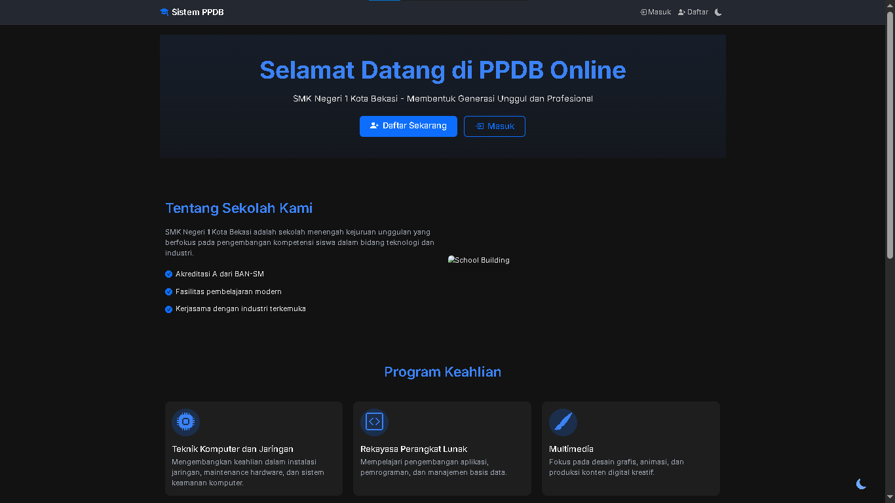
*Halaman utama website PPDB Online*

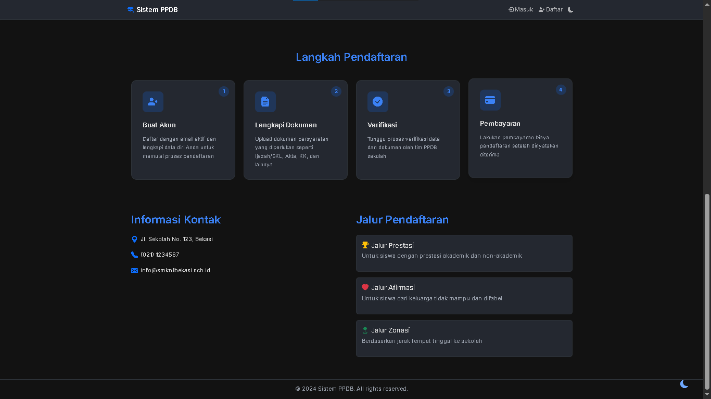
*Bagian informasi program keahlian dan jalur pendaftaran*

### Halaman Login & Register
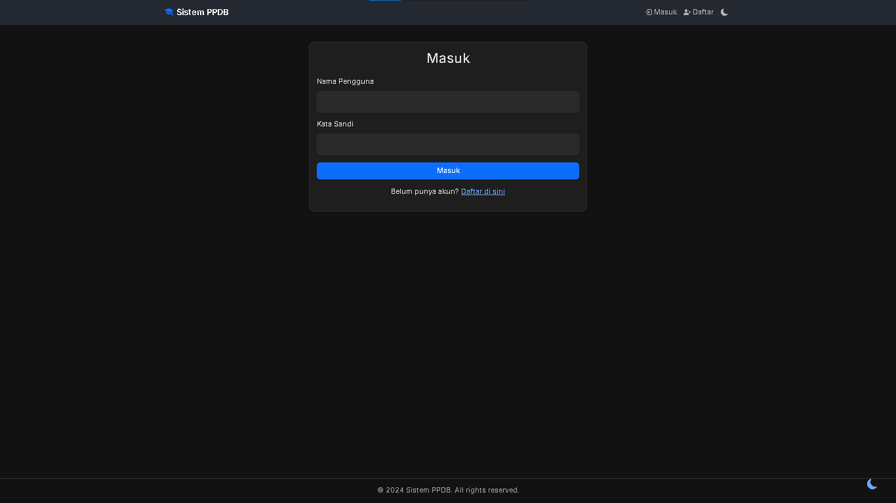
*Halaman login pengguna*

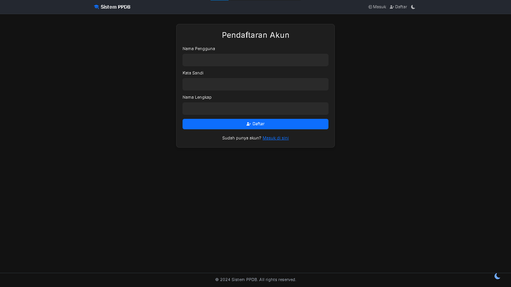
*Halaman pendaftaran akun baru*

### Dashboard Siswa
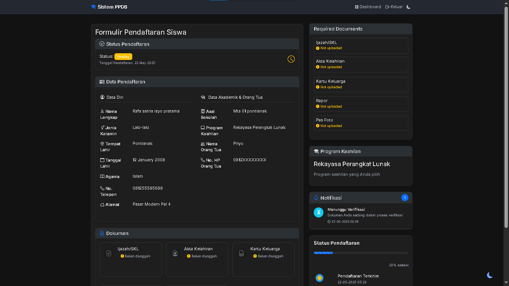
*Dashboard untuk siswa dengan status pendaftaran*

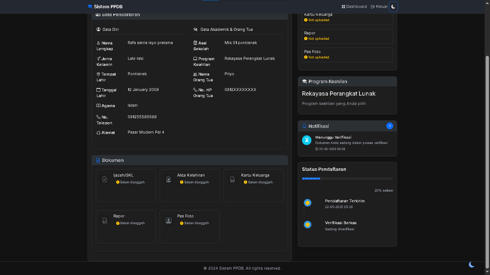
*Panel kelengkapan dokumen dan status pembayaran*

### Formulir Pendaftaran
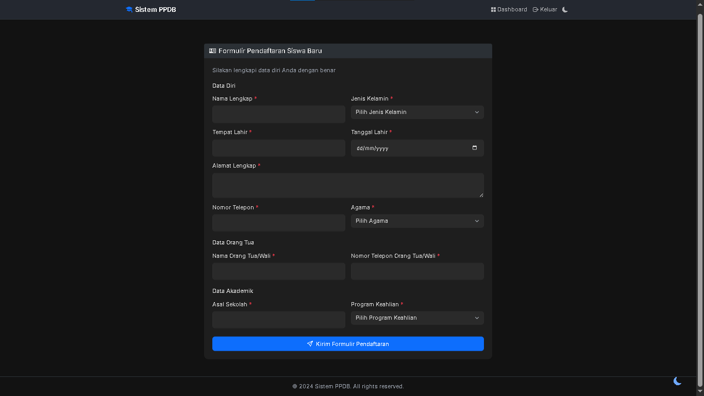
*Form pengisian data pendaftaran siswa*

### Dashboard Admin
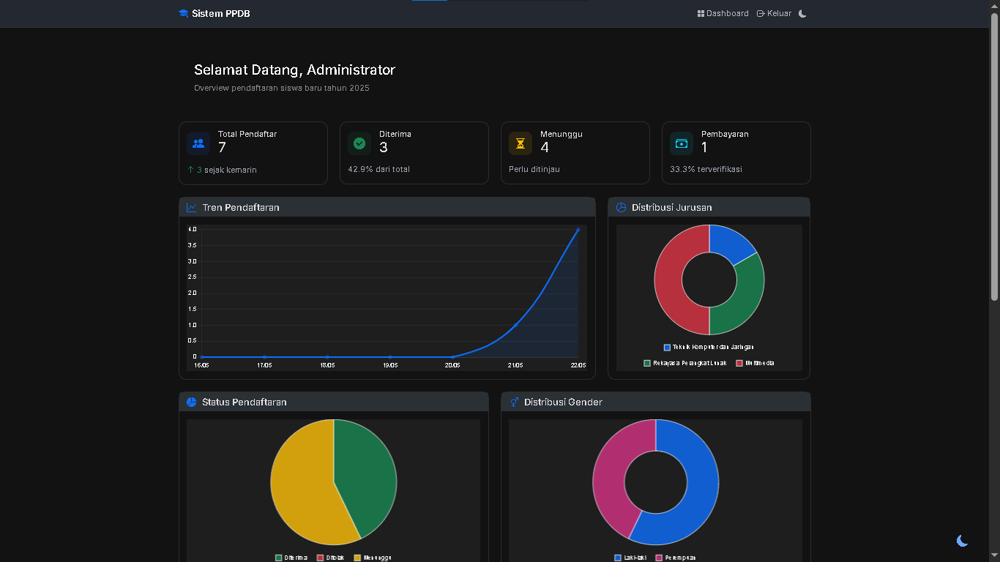
*Dashboard admin dengan grafik statistik*

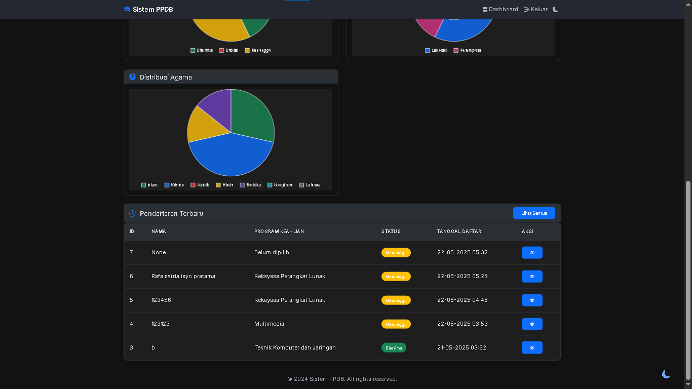
*Panel monitoring pendaftaran*

### Detail Pendaftaran
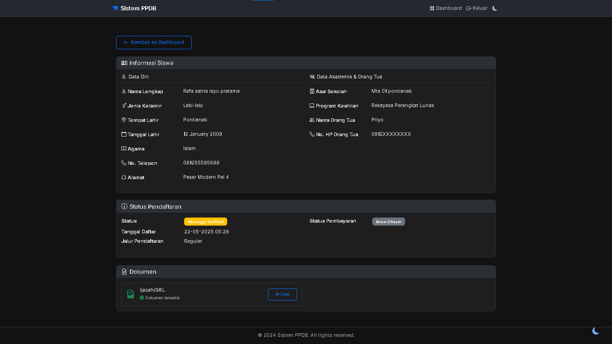
*Halaman detail data pendaftaran siswa*

### Tabel Data Pendaftar
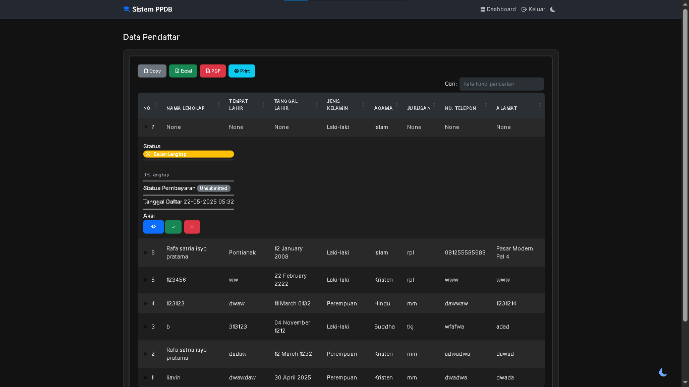
*Tabel lengkap data seluruh pendaftar*

## ✨ Fitur Utama

### 👨‍🎓 Fitur Siswa
- **Pendaftaran & Login**
  - Registrasi akun baru
  - Login dengan username dan password
  - Manajemen profil pengguna

- **Pengisian Formulir**
  - Form pendaftaran online
  - Upload dokumen persyaratan
  - Preview dokumen yang diupload
  - Edit data pendaftaran

- **Tracking Status**
  - Status verifikasi dokumen
  - Progress kelengkapan berkas
  - Status pembayaran
  - Notifikasi update status

### 👨‍💼 Fitur Admin
- **Manajemen Pendaftaran**
  - Dashboard dengan statistik real-time
  - Grafik visualisasi data pendaftar
  - Tabel data seluruh pendaftar
  - Filter dan pencarian data

- **Verifikasi & Validasi**
  - Verifikasi dokumen pendaftar
  - Validasi data siswa
  - Approval/Reject pendaftaran
  - Verifikasi pembayaran

- **Laporan & Analytics**
  - Grafik trend pendaftaran
  - Statistik per jurusan
  - Distribusi jenis kelamin
  - Export data ke Excel

## 🛠️ Teknologi yang Digunakan

<table>
  <tr>
    <th>Kategori</th>
    <th>Teknologi</th>
    <th>Kegunaan</th>
  </tr>
  <tr>
    <td rowspan="5"><b>Backend</b></td>
    <td></td>
    <td>Web framework utama</td>
  </tr>
  <tr>
    <td></td>
    <td>Database management</td>
  </tr>
  <tr>
    <td></td>
    <td>ORM (Object Relational Mapping)</td>
  </tr>
  <tr>
    <td></td>
    <td>Sistem autentikasi</td>
  </tr>
  <tr>
    <td></td>
    <td>Database migration</td>
  </tr>
  <tr>
    <td rowspan="4"><b>Frontend</b></td>
    <td></td>
    <td>Framework CSS</td>
  </tr>
  <tr>
    <td></td>
    <td>Visualisasi data & grafik</td>
  </tr>
  <tr>
    <td></td>
    <td>Tabel interaktif</td>
  </tr>
  <tr>
    <td></td>
    <td>Icon pack</td>
  </tr>
  <tr>
    <td rowspan="3"><b>Tools</b></td>
    <td></td>
    <td>Form handling & validasi</td>
  </tr>
  <tr>
    <td></td>
    <td>Password hashing & utilities</td>
  </tr>
  <tr>
    <td></td>
    <td>Environment variables</td>
  </tr>
</table>

## 🚀 Panduan Instalasi

### Prerequisites
- Python 3.10 atau lebih baru
- Git
- Web browser modern (Chrome/Firefox/Edge)

### Langkah Instalasi

<details>
<summary>1️⃣ Clone Repository</summary>

```powershell
# Clone repo
git clone https://github.com/liavin5115/PPDB_PROJECT_RPL.git

# Masuk ke direktori
cd PPDB_PROJECT_RPL
```
</details>

<details>
<summary>2️⃣ Setup Environment</summary>

```powershell
# Buat virtual environment
python -m venv venv

# Aktifkan virtual environment
.\venv\Scripts\activate

# Install dependencies
pip install -r requirements.txt
```
</details>

<details>
<summary>3️⃣ Konfigurasi Database</summary>

```powershell
# Jalankan migrasi database
flask db upgrade

# Buat user admin
flask create-admin admin password123
```
</details>

<details>
<summary>4️⃣ Jalankan Aplikasi</summary>

```powershell
# Start development server
flask run

# Buka di browser
start http://localhost:5000
```
</details>

### Troubleshooting

Jika mengalami masalah saat instalasi:

1. Pastikan Python dan Git terinstall dengan benar
2. Cek log error di terminal
3. Pastikan semua dependencies terinstall
4. Pastikan port 5000 tidak digunakan aplikasi lain

## 📁 Struktur Project

<details>
<summary>Klik untuk melihat struktur folder lengkap</summary>

```plaintext
PPDB_PROJECT_RPL/
├── 📁 app/                      # Core application
│   ├── 📄 __init__.py          # App initialization
│   ├── 📄 models.py            # Database models
│   ├── 📁 routes/              # Route handlers
│   │   ├── 📄 auth.py         # Authentication routes
│   │   └── 📄 main.py         # Main application routes
│   ├── 📁 static/              # Static files
│   │   ├── 📁 css/            # Stylesheets
│   │   ├── 📁 js/             # JavaScript
│   │   └── 📁 img/            # Images & media
│   └── 📁 templates/           # HTML templates
│       ├── 📁 admin/          # Admin views
│       ├── 📁 components/     # Reusable components
│       └── 📁 modals/         # Modal templates
├── 📁 migrations/              # Database migrations
├── 📄 config.py               # Configuration
└── 📄 run.py                  # Entry point
```

### Penjelasan Folder Utama

- `app/`: Direktori utama aplikasi
  - `routes/`: Handler untuk setiap endpoint
  - `static/`: Aset statis (CSS, JS, images)
  - `templates/`: Template HTML Jinja2
- `migrations/`: File migrasi database
- `config.py`: Konfigurasi aplikasi
- `run.py`: Entry point aplikasi

</details>
```

## 📚 Dokumentasi Lengkap

Dokumentasi lengkap dapat ditemukan di folder `docs/`:

- [Manual Pengguna](docs/USER_MANUAL.md) - Panduan lengkap penggunaan sistem
- [Changelog](docs/CHANGELOG.md) - Riwayat perubahan dan update sistem

Silakan baca dokumentasi tersebut untuk informasi lebih detail tentang penggunaan sistem dan riwayat perubahannya.

## 📞 Kontak & Dukungan

<div align="center">
  
  
  <a href="https://github.com/liavin5115">
    
  </a>
  
  <a href="mailto:rafa.satria.isyo.pratama.2008@gmail.com">
    
  </a>
</div>

## 📝 Lisensi

<div align="center">
  
  MIT License
  
  Copyright © 2025 Rafa Satria Isyo Pratama
  
  [Baca Selengkapnya](LICENSE)
  
</div>

---

<div align="center">
  <p>Dibuat dengan ❤️ oleh Rafa Satria Isyo Pratama</p>
  <p>
    <a href="#-deskripsi">Kembali ke Atas ⬆️</a>
  </p>
</div>
